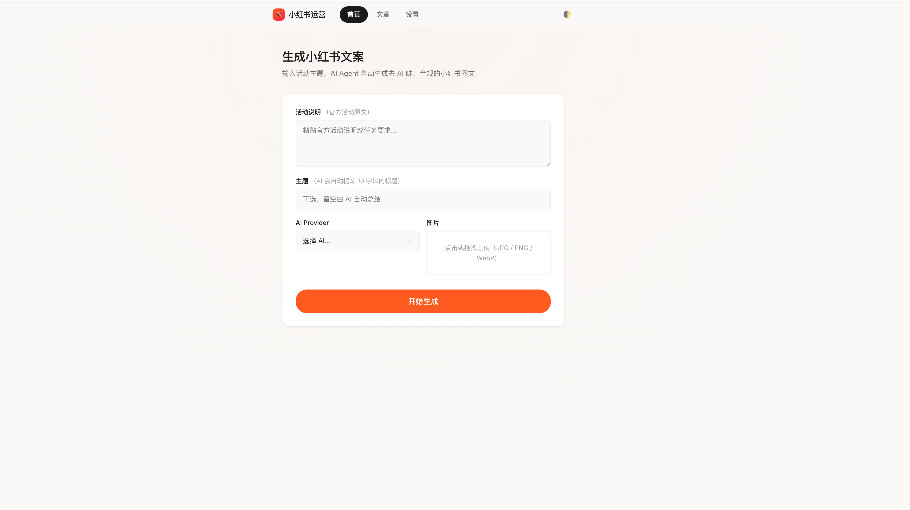
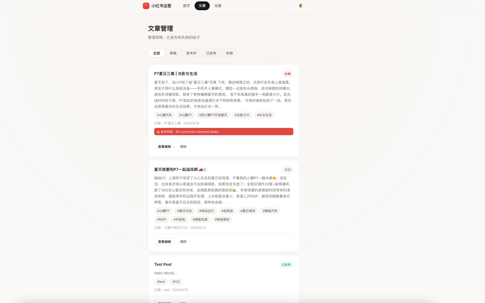
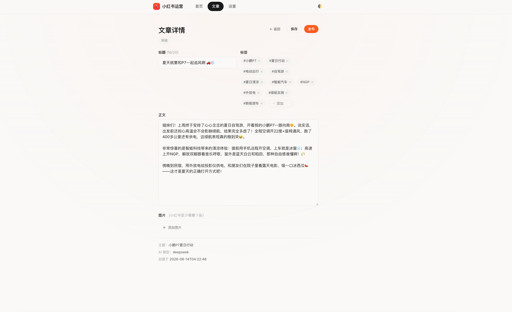
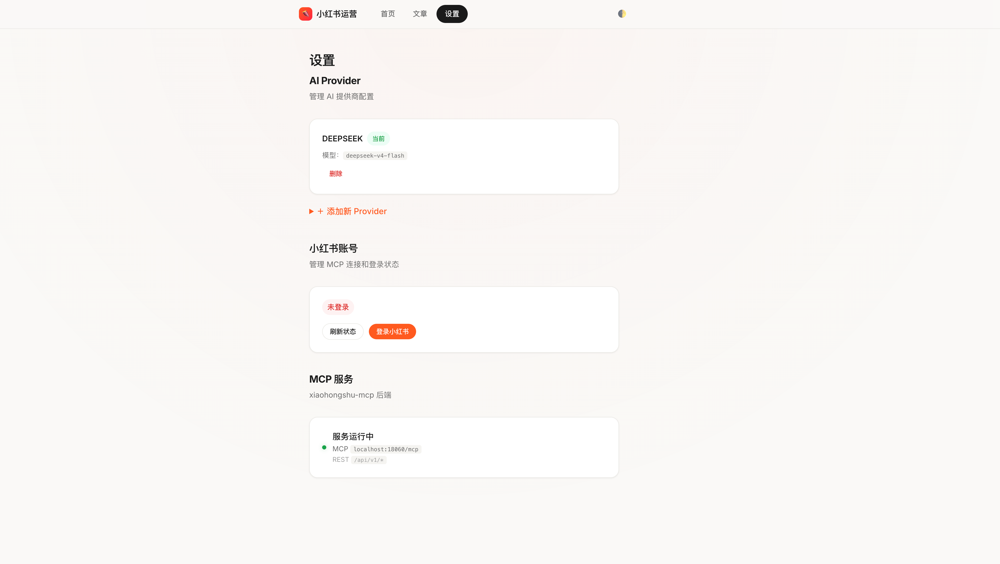

# 小红书 AI 运营平台 · Xiaohongshu AI Ops

<p align="center">
  <strong>AI-powered content generation & one-click publishing for Xiaohongshu (RED)</strong>
</p>

<p align="center">
  
  
  
  
  
</p>

***

> ⚠️ **Disclaimer** · This project is built for **personal learning and research purposes only**. It is not intended for commercial use, large-scale automation, or any activity that violates Xiaohongshu's terms of service. Use responsibly and at your own risk.
>
> ⚠️ **声明** · 本项目仅供**个人学习和研究使用**，不适用于商业用途、大规模自动化或任何违反小红书服务条款的行为。请合理使用，风险自负。

***

[English](#english) | [中文](#chinese)

***

<h2 id="english"> 🇬🇧 English</h2>

## Overview

**Xiaohongshu AI Ops** is a full-stack web application that automates the end-to-end content workflow for Xiaohongshu (RED / 小红书):

1. **Input** — Provide a theme, activity brief, and reference images
2. **Generate** — An LLM pipeline analyzes the theme, writes a post, detects and removes AI traces, and enforces platform rules
3. **Publish** — One-click publish to Xiaohongshu via the [xiaohongshu-mcp](https://github.com/xpzouying/xiaohongshu-mcp) browser-automation service

The frontend streams generation progress in real-time via SSE, and all drafts are saved locally for review before publishing.

> 🎵 This project was built through **vibe coding** — AI-assisted development with [Claude Code](https://claude.ai/code). 100% of the codebase was written through conversations with AI.

<!-- TODO: add screenshots here -->

<!--  -->




## Features

- **Multi-provider LLM** — Supports OpenAI, DeepSeek, and Anthropic (Claude). Configure API keys and models in the Settings page.
- **7-node Agent Pipeline** — Theme analysis → Content generation → AI detection → Humanization → XHS compliance → Draft save → Publish. Built on [LangGraph](https://github.com/langchain-ai/langgraph).
- **Anti-AI detection** — Automatically flags AI-sounding text (overly formal patterns, marketing jargon, emoji regularity) and humanizes it into authentic, first-person Chinese social-media voice.
- **XHS platform compliance** — Enforces title ≤ 20 characters (字节-correct), body ≤ 500 chars, 5–10 tags, banned-word filtering, and no inline hashtags in body text.
- **Real-time progress** — SSE streaming shows each pipeline node's status as it runs.
- **Draft management** — Browse, edit, and publish drafts from a local dashboard.
- **Docker-ready** — Two-container setup (app + MCP) with `docker compose`.

## Architecture

```
┌─────────────────────────────────────────────────┐
│                    Browser                       │
│              http://localhost:8000               │
└──────────────────┬──────────────────────────────┘
                   │  SSE / REST
┌──────────────────▼──────────────────────────────┐
│              FastAPI App (app/)                  │
│                                                  │
│  ┌──────────┐  ┌──────────┐  ┌──────────────┐   │
│  │ Routers   │  │ Agent    │  │ Services      │   │
│  │ · pages   │  │ · graph  │  │ · llm_factory │   │
│  │ · posts   │  │ · nodes  │  │ · xhs_client  │   │
│  │ · agent   │  │ · prompts│  └──────────────┘   │
│  │ · configs │  │ · tools  │                      │
│  │ · xhs     │  │ · state  │                      │
│  └──────────┘  └──────────┘                      │
│                                                  │
│  SQLite (data/app.db) · Jinja2 + Vue 3 Templates │
└──────────────────┬──────────────────────────────┘
                   │  HTTP (Docker network: mcp:18060)
┌──────────────────▼──────────────────────────────┐
│         xiaohongshu-mcp (Docker)                │
│         xpzouying/xiaohongshu-mcp               │
│                                                  │
│     Headless browser automation for XHS          │
│     · QR login · cookie persistence              │
│     · Publish notes · feed verification          │
└─────────────────────────────────────────────────┘
```

### Agent Pipeline (LangGraph)

```
theme_analyzer → content_generator → ai_detector
                                         │
                          ┌──────────────┼──────────────┐
                          ▼ (AI traces found)           ▼ (clean)
                      humanizer                    xhs_optimizer
                          │                             │
                          └──────────┬──────────────────┘
                                     ▼
                                save_draft
                                     │
                                (manual trigger)
                                     ▼
                                publisher
```

| Node                | Role       | Description                                                      |
| ------------------- | ---------- | ---------------------------------------------------------------- |
| `theme_analyzer`    | Analysis   | Extracts short theme (≤10 chars), style, keywords, audience      |
| `content_generator` | Creation   | Writes title + body + tags in authentic first-person voice       |
| `ai_detector`       | QA         | Flags AI patterns (排比句, 营销话术, emoji regularity, etc.)            |
| `humanizer`         | Polish     | Rewrites flagged sections into genuine colloquial Chinese        |
| `xhs_optimizer`     | Compliance | Enforces title/body length, strips banned words, validates tags  |
| `save_draft`        | Persist    | Saves to SQLite; fallback to AI-extracted theme if empty         |
| `publisher`         | Publish    | Sends to MCP, polls feed for verification with staggered retries |

### Frontend

- **Template engine**: Jinja2 (with `<< >>` delimiters to coexist with Vue's `{{ }}`)
- **Reactivity**: Vue 3 (loaded via CDN, no build step)
- **Modular JS**: Each page has its own Vue app (`index-form.js`, `post-editor.js`, `settings-page.js`, etc.)
- **Styling**: Vanilla CSS with CSS variables for theming

## Quick Start

### Prerequisites

- [Docker](https://docs.docker.com/get-docker/) and Docker Compose
- An API key from at least one LLM provider (OpenAI, DeepSeek, or Anthropic)

### 1. Clone & Start

```bash
git clone https://github.com/<your-username>/xiaohongshu-ai-ops.git
cd xiaohongshu-ai-ops
docker compose up -d
```

This starts two containers:

- **app** — FastAPI backend on `http://localhost:8000`
- **mcp** — Xiaohongshu MCP service on `http://localhost:18060`

### 2. Configure AI Provider

Open `http://localhost:8000/settings`, add an AI configuration:

| Field    | Example                                          |
| -------- | ------------------------------------------------ |
| Provider | `openai` / `deepseek` / `claude`                 |
| API Key  | `sk-...` (encrypted at rest with Fernet)         |
| Model    | `gpt-4o` / `deepseek-chat` / `claude-sonnet-4-6` |
| API Base | (optional) custom endpoint                       |

Activate it, and you're ready.




### 3. Login to Xiaohongshu

The MCP service handles browser automation. On first use, navigate to the XHS section in the app to scan the QR code for login. Cookies are persisted in `./mcp-data`.

### 4. Generate & Publish

1. Go to the **Home** page (`/`)
2. Fill in the theme, activity description, and upload reference images
3. Click **Generate** — watch the pipeline stream in real-time
4. Review the draft on the **Posts** page (`/posts`)
5. Click **Publish** to send it to Xiaohongshu

## Project Structure

```
.
├── app/
│   ├── main.py                  # FastAPI entry point, middleware, startup
│   ├── config.py                # Fernet encryption, env vars
│   ├── db.py                    # SQLAlchemy + SQLite setup
│   ├── models.py                # AIConfig, Post, GenerationHistory
│   ├── schemas.py               # Pydantic request/response schemas
│   ├── agent/
│   │   ├── graph.py             # LangGraph workflow + AgentRunner
│   │   ├── nodes.py             # 7 pipeline node implementations
│   │   ├── prompts.py           # All LLM prompts (Chinese)
│   │   ├── state.py             # AgentState TypedDict
│   │   └── tools.py             # LangChain tools (publish, check status)
│   ├── routers/
│   │   ├── pages.py             # HTML page routes
│   │   ├── posts.py             # Post CRUD API
│   │   ├── agent.py             # SSE generation + publish endpoints
│   │   ├── configs.py           # AI config CRUD
│   │   └── xhs.py               # XHS login status, QR code, profile
│   ├── services/
│   │   ├── llm_factory.py       # Multi-provider LLM instantiation
│   │   └── xhs_client.py        # HTTP client for xiaohongshu-mcp REST API
│   └── templates/               # Jinja2 + Vue 3 HTML pages
│       ├── base.html
│       ├── index.html           # Home: generation form
│       ├── generate.html        # Generation progress (SSE)
│       ├── posts.html           # Draft/published list
│       ├── post_detail.html     # Edit & publish single post
│       └── settings.html        # AI provider configuration
├── static/                      # Vue 3 components (modular JS)
│   ├── vue.common.js            # Shared Vue helpers
│   ├── index-form.js
│   ├── generate-progress.js
│   ├── post-list.js
│   ├── post-editor.js
│   └── settings-page.js
├── data/                        # SQLite DB + uploaded images (mounted volume)
│   ├── app.db
│   └── uploads/
├── tests/                       # pytest test suite
├── docker-compose.yml           # Two-service Docker setup
├── Dockerfile                   # Python 3.12-slim app image
├── dev.sh                       # Local dev script (MCP in Docker, app local)
└── requirements.txt
```

## Configuration

| Environment Variable | Default                  | Description                         |
| -------------------- | ------------------------ | ----------------------------------- |
| `XHS_MCP_URL`        | `http://localhost:18060` | MCP service URL                     |
| `FERNET_KEY`         | auto-generated           | Key for encrypting API keys at rest |
| `DATABASE_PATH`      | `data/app.db`            | SQLite database path                |
| `UPLOADS_DIR`        | `data/uploads`           | Image upload directory              |

## Security Notes

- API keys are encrypted at rest using **Fernet** (symmetric encryption). The key is auto-generated on first run and stored in `data/.fernet_key`.
- Set `FERNET_KEY` explicitly in production to avoid key regeneration on redeploy.
- The MCP service stores Xiaohongshu cookies in `./mcp-data`. Keep this directory secure.
- Never commit `data/` or `mcp-data/` — they contain sensitive information.

## Development

```bash
# Local dev: MCP in Docker, app with hot-reload on :8080
./dev.sh

# Run tests
uv run pytest tests/ -v
```

## Tech Stack

| Layer              | Technology                                                      |
| ------------------ | --------------------------------------------------------------- |
| Backend            | Python 3.12, FastAPI, Uvicorn                                   |
| AI Pipeline        | LangChain, LangGraph                                            |
| LLM Providers      | OpenAI, DeepSeek, Anthropic (Claude)                            |
| Database           | SQLite + SQLAlchemy                                             |
| Frontend           | Jinja2 templates, Vue 3 (CDN), vanilla CSS                      |
| Browser Automation | [xiaohongshu-mcp](https://github.com/xpzouying/xiaohongshu-mcp) |
| Deployment         | Docker, Docker Compose                                          |

## License

MIT — see the [LICENSE](LICENSE) file for details.

***

<h2 id="chinese"> 🇨🇳 中文</h2>

## 项目简介

**小红书 AI 运营平台** 是一个全栈 Web 应用，自动完成小红书内容运营的全流程：

1. **输入** — 提供主题、活动说明和参考图片
2. **生成** — LLM 管道分析主题、撰写文案、检测并消除 AI 痕迹、强制执行平台规则
3. **发布** — 通过 [xiaohongshu-mcp](https://github.com/xpzouying/xiaohongshu-mcp) 浏览器自动化服务一键发布到小红书

前端通过 SSE 实时流式展示生成进度，所有草稿本地保存，发布前可随时预览和修改。

> 🎵 本项目通过 **vibe coding** 方式构建 — 使用 [Claude Code](https://claude.ai/code) 进行 AI 辅助开发，100% 代码由与 AI 的对话生成。

<!-- TODO: add screenshots here -->

<!--  -->


## 功能特性

- **多厂商 LLM 支持** — 支持 OpenAI、DeepSeek、Anthropic (Claude)，在设置页面配置 API Key 和模型。
- **7 节点 Agent 管道** — 主题解析 → 文案生成 → AI 痕迹检测 → 口语化润色 → 小红书合规 → 保存草稿 → 发布。基于 [LangGraph](https://github.com/langchain-ai/langgraph) 构建。
- **反 AI 检测** — 自动识别 AI 生成痕迹（过于工整的排比句、营销话术、emoji 规律使用等），并将其改写为真实车主分享的口吻。
- **小红书平台合规** — 标题 ≤ 20 字（中文字按 2 字节计算）、正文 ≤ 500 字、标签 5-10 个、违禁词过滤、正文内不允许出现 #标签。
- **实时进度** — SSE 流式展示每个管道节点的运行状态。
- **草稿管理** — 在本地面板中浏览、编辑、发布草稿。
- **Docker 就绪** — `docker compose up -d` 一键启动 app + MCP 双容器。

## 系统架构

```
┌─────────────────────────────────────────────────┐
│                    浏览器                        │
│              http://localhost:8000               │
└──────────────────┬──────────────────────────────┘
                   │  SSE / REST
┌──────────────────▼──────────────────────────────┐
│              FastAPI 应用 (app/)                  │
│                                                  │
│  ┌──────────┐  ┌──────────┐  ┌──────────────┐   │
│  │ Routers   │  │ Agent    │  │ Services      │   │
│  │ · pages   │  │ · graph  │  │ · llm_factory │   │
│  │ · posts   │  │ · nodes  │  │ · xhs_client  │   │
│  │ · agent   │  │ · prompts│  └──────────────┘   │
│  │ · configs │  │ · tools  │                      │
│  │ · xhs     │  │ · state  │                      │
│  └──────────┘  └──────────┘                      │
│                                                  │
│  SQLite (data/app.db) · Jinja2 + Vue 3 模板      │
└──────────────────┬──────────────────────────────┘
                   │  HTTP (Docker 内部网络: mcp:18060)
┌──────────────────▼──────────────────────────────┐
│         xiaohongshu-mcp (Docker)                │
│         xpzouying/xiaohongshu-mcp               │
│                                                  │
│     无头浏览器自动化操作小红书                     │
│     · 二维码登录 · Cookie 持久化                  │
│     · 发布笔记 · Feed 验证                        │
└─────────────────────────────────────────────────┘
```

### Agent 管道 (LangGraph)

```
theme_analyzer → content_generator → ai_detector
                                         │
                          ┌──────────────┼──────────────┐
                          ▼ (检测到 AI 痕迹)             ▼ (内容正常)
                      humanizer                    xhs_optimizer
                          │                             │
                          └──────────┬──────────────────┘
                                     ▼
                                save_draft
                                     │
                                (手动触发发布)
                                     ▼
                                publisher
```

| 节点                  | 功能    | 说明                                     |
| ------------------- | ----- | -------------------------------------- |
| `theme_analyzer`    | 主题解析  | 提取 10 字以内的精简主题、风格、关键词、受众               |
| `content_generator` | 文案生成  | 以真实车主第一人称撰写标题 + 正文 + 标签                |
| `ai_detector`       | AI 检测 | 标记 AI 痕迹（排比句、营销话术、emoji 规律等）           |
| `humanizer`         | 润色    | 将标记段落改写为口语化中文                          |
| `xhs_optimizer`     | 合规终审  | 标题/正文字数校验、违禁词替换、标签数量检查                 |
| `save_draft`        | 保存草稿  | 写入 SQLite；主题为空时回退到 AI 提取的 short\_theme |
| `publisher`         | 发布    | 调用 MCP 发布，随后在 Feed 中分级重试验证             |

### 前端

- **模板引擎**：Jinja2（使用 `<< >>` 分隔符，与 Vue 的 `{{ }}` 共存）
- **响应式**：Vue 3（CDN 加载，无需构建步骤）
- **模块化 JS**：每个页面对应独立 Vue 应用（`index-form.js`、`post-editor.js`、`settings-page.js` 等）
- **样式**：原生 CSS + CSS 变量实现主题切换

## 快速开始

### 环境要求

- [Docker](https://docs.docker.com/get-docker/) 和 Docker Compose
- 至少一个 LLM 厂商的 API Key（OpenAI / DeepSeek / Anthropic）

### 1. 克隆并启动

```bash
git clone https://github.com/<your-username>/xiaohongshu-ai-ops.git
cd xiaohongshu-ai-ops
docker compose up -d
```

启动两个容器：

- **app** — FastAPI 后端，端口 `http://localhost:8000`
- **mcp** — 小红书 MCP 服务，端口 `http://localhost:18060`

### 2. 配置 AI 供应商

打开 `http://localhost:8000/settings`，添加 AI 配置：

| 字段             | 示例                                               |
| -------------- | ------------------------------------------------ |
| 供应商 (Provider) | `openai` / `deepseek` / `claude`                 |
| API Key        | `sk-...`（使用 Fernet 加密存储）                         |
| 模型 (Model)     | `gpt-4o` / `deepseek-chat` / `claude-sonnet-4-6` |
| API Base       | （可选）自定义接口地址                                      |

激活后即可使用。


### 3. 登录小红书

MCP 服务处理浏览器自动化。首次使用时，在应用中进入小红书模块，扫描二维码登录。Cookie 保存在 `./mcp-data` 目录中。

### 4. 生成并发布

1. 进入**首页** (`/`)
2. 填写主题、活动说明，上传参考图片
3. 点击**生成** — 实时观看管道流程
4. 在**帖子管理** (`/posts`) 中预览草稿
5. 点击**发布**，一键发送到小红书

## 项目结构

```
.
├── app/
│   ├── main.py                  # FastAPI 入口、中间件、启动逻辑
│   ├── config.py                # Fernet 加密、环境变量
│   ├── db.py                    # SQLAlchemy + SQLite 初始化
│   ├── models.py                # AIConfig, Post, GenerationHistory 数据模型
│   ├── schemas.py               # Pydantic 请求/响应模型
│   ├── agent/
│   │   ├── graph.py             # LangGraph 工作流 + AgentRunner
│   │   ├── nodes.py             # 7 个管道节点实现
│   │   ├── prompts.py           # 全部 LLM 提示词（中文）
│   │   ├── state.py             # AgentState TypedDict 状态定义
│   │   └── tools.py             # LangChain 工具（发布、状态查询）
│   ├── routers/
│   │   ├── pages.py             # HTML 页面路由
│   │   ├── posts.py             # 帖子增删改查 API
│   │   ├── agent.py             # SSE 生成 + 发布端点
│   │   ├── configs.py           # AI 配置管理
│   │   └── xhs.py               # 小红书登录状态、二维码、用户信息
│   ├── services/
│   │   ├── llm_factory.py       # 多厂商 LLM 工厂
│   │   └── xhs_client.py        # xiaohongshu-mcp REST API HTTP 客户端
│   └── templates/               # Jinja2 + Vue 3 HTML 页面
│       ├── base.html
│       ├── index.html           # 首页：生成表单
│       ├── generate.html        # 生成进度页（SSE）
│       ├── posts.html           # 草稿/已发布列表
│       ├── post_detail.html     # 单帖编辑与发布
│       └── settings.html        # AI 供应商配置
├── static/                      # Vue 3 模块化 JS 组件
│   ├── vue.common.js            # 公共 Vue 工具函数
│   ├── index-form.js
│   ├── generate-progress.js
│   ├── post-list.js
│   ├── post-editor.js
│   └── settings-page.js
├── data/                        # SQLite 数据库 + 上传图片（挂载卷）
│   ├── app.db
│   └── uploads/
├── tests/                       # pytest 测试套件
├── docker-compose.yml           # 双服务 Docker 编排
├── Dockerfile                   # Python 3.12-slim 应用镜像
├── dev.sh                       # 本地开发脚本（MCP 在 Docker，后端本地）
└── requirements.txt
```

## 环境变量

| 环境变量            | 默认值                      | 说明             |
| --------------- | ------------------------ | -------------- |
| `XHS_MCP_URL`   | `http://localhost:18060` | MCP 服务地址       |
| `FERNET_KEY`    | 自动生成                     | API Key 静态加密密钥 |
| `DATABASE_PATH` | `data/app.db`            | SQLite 数据库路径   |
| `UPLOADS_DIR`   | `data/uploads`           | 图片上传目录         |

## 安全注意事项

- API Key 使用 **Fernet** 对称加密存储，密钥在首次运行时自动生成并存于 `data/.fernet_key`。
- 生产环境建议显式设置 `FERNET_KEY`，避免重建容器时密钥变更导致已加密数据无法解密。
- MCP 服务的小红书 Cookie 存储在 `./mcp-data` 目录中，请勿泄露。
- 不要将 `data/` 和 `mcp-data/` 目录提交到 Git — 它们包含敏感信息。

## 本地开发

```bash
# 本地开发模式：MCP 在 Docker，后端本地热重载 (端口 8080)
./dev.sh

# 运行测试
uv run pytest tests/ -v
```

## 技术栈

| 层级     | 技术选型                                                            |
| ------ | --------------------------------------------------------------- |
| 后端     | Python 3.12, FastAPI, Uvicorn                                   |
| AI 管道  | LangChain, LangGraph                                            |
| LLM 厂商 | OpenAI, DeepSeek, Anthropic (Claude)                            |
| 数据库    | SQLite + SQLAlchemy                                             |
| 前端     | Jinja2 模板, Vue 3 (CDN), 原生 CSS                                  |
| 浏览器自动化 | [xiaohongshu-mcp](https://github.com/xpzouying/xiaohongshu-mcp) |
| 部署     | Docker, Docker Compose                                          |

## 致谢

本项目依赖 **[xiaohongshu-mcp](https://github.com/xpzouying/xiaohongshu-mcp)** 开源项目来实现小红书浏览器自动化操作，感谢作者的贡献。

## 许可证

MIT — 详见 [LICENSE](LICENSE) 文件。
